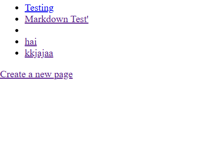
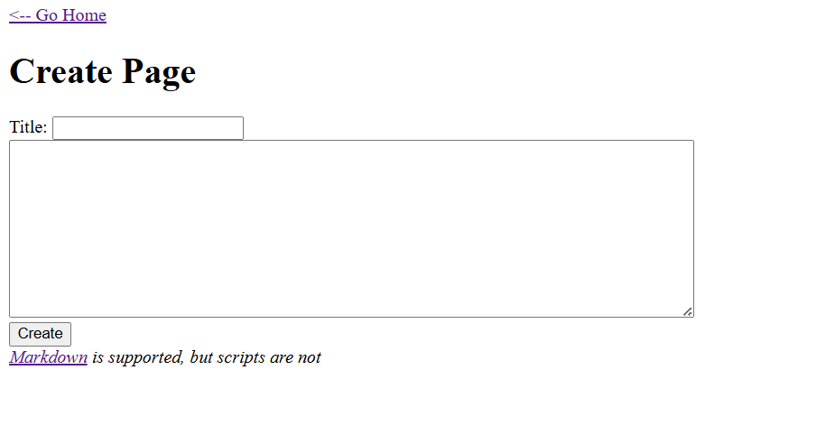
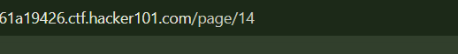
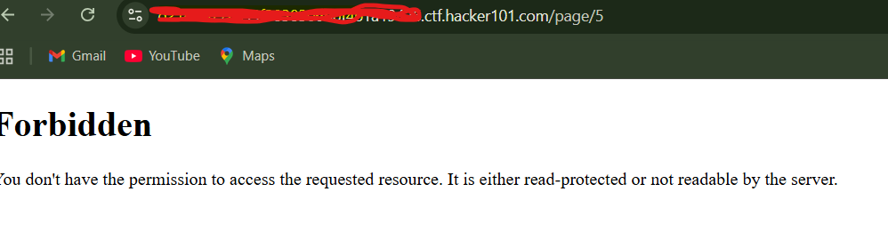
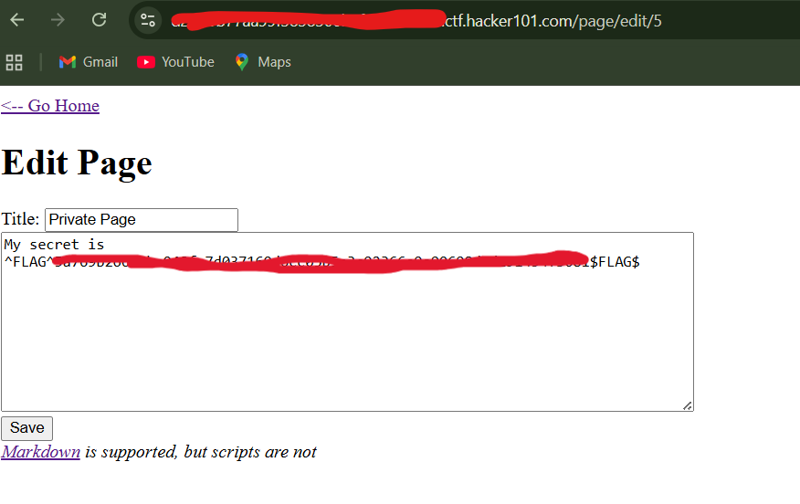

1. when i am in page , there are 3 links that i can click it and go to another page 

2. i just click create page , i find form input , notice form input is the best way to try some injection like xss. but in this case i try fill input without any injection

3. when i finish create, something interesting showing in url like this https://yourID.ctf.hacker101.com/page/13, so i wondering if i could change the number , could i find something interest?

*picture urls

4. so i try number 1 -5 i suprised when i change number to 5 , the page showing forbidden

*showing forbidden

5. i go to my own page that i created , i find edit page and i see my url is like this https://yourID.ctf.hacker101.com/page/edit/13 , then i try change number to 5 . when im in page look in form input there is flag 
