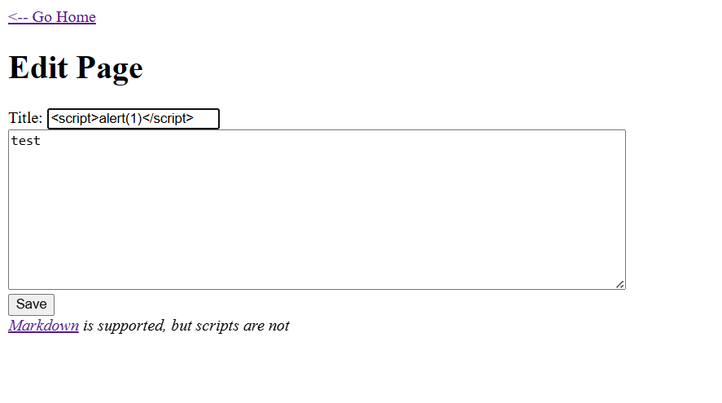
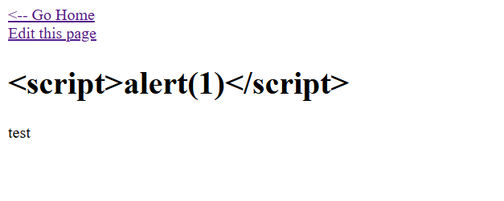
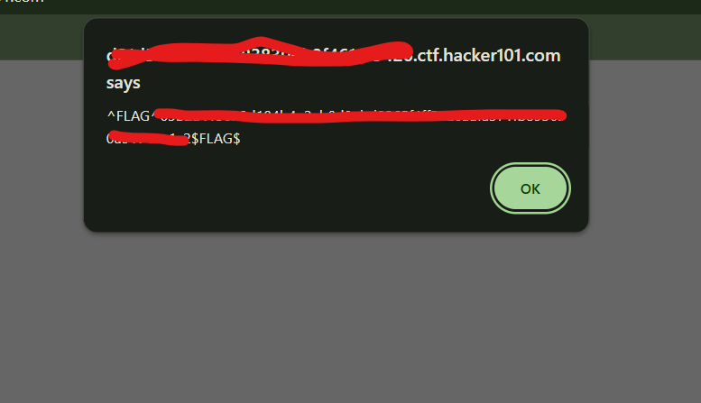

1. when you are in page, go to create page notice there is input form, input form is the best way to try injection like xss

2. try xss in input title  then save it

3. go back to home and notice will showing alert with flag  " ^FLAG^random number$FLAG$ "
