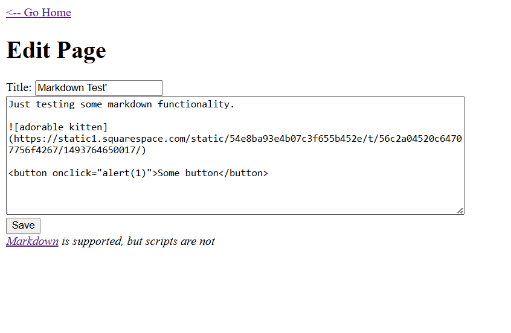
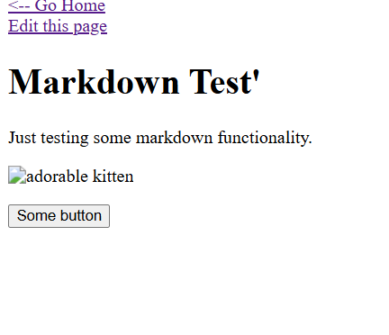
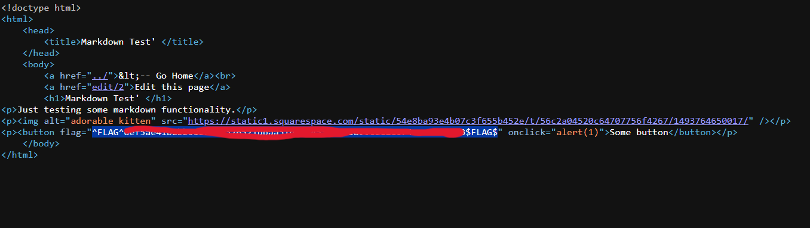

1. in home page, there is link to markdown test , i just click it an see markdown  have sintax button

2. inside button sintax i add dom xss onclick="alert(1)" and the i save it 

3. i click button nothing happen so i checked source page and you see there is flags , in this case dom xss is work 

