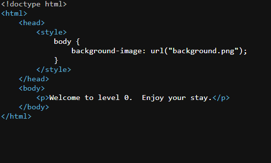

1. when you open the page you will find nothing special no button click, no image it just contain text then you try inspect by right click and enter the source page 

2. look closely you will find something interesting, in the source page you will find something link image but on page no image view then go to url

3. try to https://yourID.ctf.hacker101.com/background.png after run it you will find flags like this --> ^FLAG^random number$FLAG$
